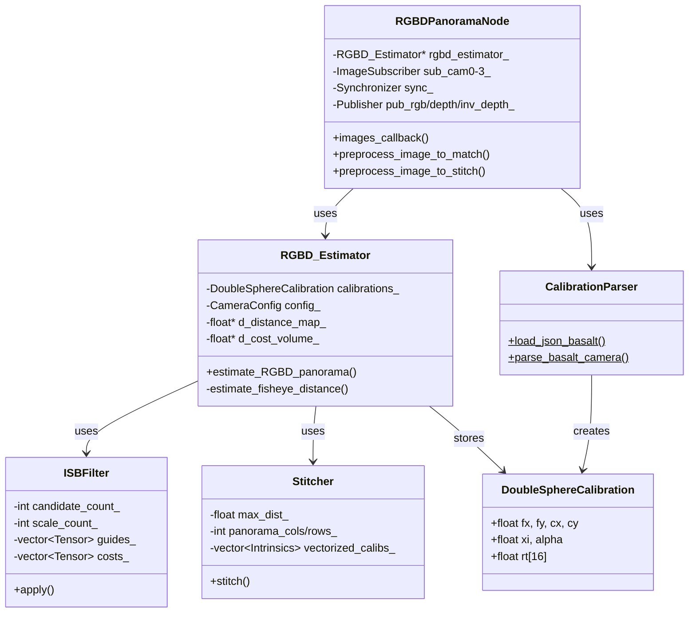

# ROS2統合RGBDパノラマシステム - 完全アーキテクチャ

## システム全体のフローチャート

```mermaid
flowchart TD
    %% ハードウェア層
    CAM1[魚眼カメラ1<br/>USB3.0]
    CAM2[魚眼カメラ2<br/>USB3.0]
    CAM3[魚眼カメラ3<br/>USB3.0]
    CAM4[魚眼カメラ4<br/>USB3.0]
    
    %% ROS2カメラノード層
    CAM1 --> NODE1[cam_node_0<br/>GStreamer Pipeline]
    CAM2 --> NODE2[cam_node_1<br/>GStreamer Pipeline]
    CAM3 --> NODE3[cam_node_2<br/>GStreamer Pipeline]
    CAM4 --> NODE4[cam_node_3<br/>GStreamer Pipeline]
    
    %% ROS2トピック
    NODE1 --> |/camera_0/image_raw| SYNC[Message Filters<br/>Approximate Time Sync]
    NODE2 --> |/camera_1/image_raw| SYNC
    NODE3 --> |/camera_2/image_raw| SYNC
    NODE4 --> |/camera_3/image_raw| SYNC
    
    %% キャリブレーション
    CALIB_FILE[calibration.json<br/>Basalt Format] --> CALIB_LOAD[CalibrationParser<br/>load_json_basalt]
    CALIB_LOAD --> DS_CALIB[DoubleSphereCalibration<br/>×4カメラ]
    
    %% ROS2 RGBDパノラマノード
    SYNC --> RGBD_NODE[RGBDPanoramaNode<br/>C++/ROS2]
    DS_CALIB --> RGBD_NODE
    
    %% 画像前処理
    RGBD_NODE --> PREPROC_MATCH[画像前処理<br/>Matching用]
    RGBD_NODE --> PREPROC_STITCH[画像前処理<br/>Stitching用]
    
    PREPROC_MATCH --> |Resize: 1024x1024<br/>BGR→RGB| MATCH_IMGS[images_to_match<br/>std::vector]
    PREPROC_STITCH --> |Resize: 1216x1216<br/>BGR→RGB| STITCH_IMGS[images_to_stitch<br/>std::vector]
    
    %% RGBD Estimator
    MATCH_IMGS --> RGBD_EST[RGBD_Estimator<br/>depth_estimation.cpp]
    STITCH_IMGS --> RGBD_EST
    DS_CALIB --> RGBD_EST
    
    %% リファレンスカメラループ
    RGBD_EST --> REF_LOOP{各リファレンス<br/>カメラ処理}
    
    %% GPU処理パイプライン
    REF_LOOP --> CAM_SELECT[カメラ選択<br/>select_best_cameras_kernel<br/>CUDA]
    CAM_SELECT --> |適応的選択| COST_VOL[コストボリューム計算<br/>compute_cost_volume_kernel<br/>CUDA]
    
    COST_VOL --> ISB[ISBフィルター<br/>isb_filter.cpp/cu]
    
    %% ISBフィルター詳細
    ISB --> DOWN[ダウンサンプリング<br/>guideDownsample2xKernel<br/>CUDA]
    DOWN --> |多解像度ピラミッド| UP[アップサンプリング<br/>guideUpsample2xKernel<br/>CUDA]
    UP --> DIST_SELECT[深度選択<br/>select_distance_from_cost_volume<br/>CUDA]
    
    DIST_SELECT --> DIST_MAPS[距離マップ<br/>×リファレンス数<br/>std::vector&lt;float&gt;]
    
    %% ステッチング処理
    DIST_MAPS --> STITCH[Stitcher<br/>stitcher.cpp/cu]
    STITCH_IMGS --> STITCH
    DS_CALIB --> STITCH
    
    %% ステッチング詳細
    STITCH --> REPROJ[距離マップ再投影<br/>reprojectDistanceKernel<br/>CUDA]
    REPROJ --> INPAINT_W[インペイント重み生成<br/>createInpaintingWeightsKernel<br/>CUDA]
    INPAINT_W --> INPAINT[インペイント処理<br/>inpaintKernel<br/>CUDA]
    INPAINT --> BLEND_LUT[ブレンディングLUT作成<br/>createBlendingLutKernel<br/>CUDA]
    BLEND_LUT --> MERGE[RGBDパノラマ結合<br/>mergeRGBDPanoramaKernel<br/>CUDA]
    
    %% 出力データ
    MERGE --> RGB_OUT[RGBパノラマ<br/>std::vector&lt;uint8_t&gt;<br/>2048x1024]
    MERGE --> DEPTH_OUT[深度マップ<br/>std::vector&lt;float&gt;<br/>2048x1024]
    
    %% ROS2メッセージ変換
    RGB_OUT --> RGB_MSG[sensor_msgs/Image<br/>encoding: rgb8]
    DEPTH_OUT --> DEPTH_MSG[sensor_msgs/Image<br/>encoding: 32FC1]
    DEPTH_OUT --> INV_DEPTH[逆深度計算<br/>1/distance]
    INV_DEPTH --> INV_MSG[sensor_msgs/Image<br/>encoding: 32FC1]
    
    %% ROS2パブリッシャー
    RGB_MSG --> PUB1[/rgbd_panorama/rgb]
    DEPTH_MSG --> PUB2[/rgbd_panorama/depth]
    INV_MSG --> PUB3[/rgbd_panorama/inv_depth]
    
    %% 可視化・記録
    PUB1 & PUB2 & PUB3 --> VIZ[rqt_image_view<br/>可視化]
    PUB1 & PUB2 & PUB3 --> BAG[rosbag2<br/>データ記録]
    
    %% GPU処理の強調
    subgraph GPU_PROCESSING[CUDA GPU処理]
        CAM_SELECT
        COST_VOL
        DOWN
        UP
        DIST_SELECT
        REPROJ
        INPAINT_W
        INPAINT
        BLEND_LUT
        MERGE
    end
    
    %% CPU処理の強調
    subgraph CPU_PROCESSING[CPU処理]
        CALIB_LOAD
        RGBD_NODE
        PREPROC_MATCH
        PREPROC_STITCH
        RGBD_EST
        ISB
        STITCH
        RGB_MSG
        DEPTH_MSG
        INV_MSG
    end
    
    %% ROS2システム
    subgraph ROS2_SYSTEM[ROS2システム]
        NODE1
        NODE2
        NODE3
        NODE4
        SYNC
        RGBD_NODE
        PUB1
        PUB2
        PUB3
    end
    
    %% スタイル
    style CAM1 fill:#e1f5ff
    style CAM2 fill:#e1f5ff
    style CAM3 fill:#e1f5ff
    style CAM4 fill:#e1f5ff
    style PUB1 fill:#c8e6c9
    style PUB2 fill:#c8e6c9
    style PUB3 fill:#c8e6c9
    style GPU_PROCESSING fill:#fff3e0
    style CPU_PROCESSING fill:#f3e5f5
    style ROS2_SYSTEM fill:#e3f2fd
```

## クラス図とモジュール依存関係



## データフロー詳細

### 1. 入力ステージ
- **入力**: 4つの魚眼カメラ画像 (1944x1096, BGR8)
- **同期**: message_filters で100ms許容の近似時刻同期
- **変換**: cv_bridge で ROS Image → cv::Mat

### 2. 前処理ステージ
- **Matching用**: 1024x1024にリサイズ、BGR→RGB、float32変換
- **Stitching用**: 1216x1216にリサイズ、BGR→RGB、float32変換

### 3. 深度推定ステージ (GPU)
- **カメラ選択**: 各ピクセルで最適な視点を適応的に選択
- **コストボリューム**: 32候補 × 1024×1024 = 33M要素
- **ISBフィルタ**: 多解像度bilateral filter (5スケール)
- **出力**: 距離マップ (float32)

### 4. ステッチングステージ (GPU)
- **再投影**: 各カメラの距離マップをパノラマ座標に変換
- **インペイント**: 欠損領域を周辺情報から補完
- **ブレンディング**: 複数ビューを重み付き平均で合成
- **出力**: 2048x1024 RGBパノラマ + 深度マップ

### 5. パブリッシュステージ
- **RGB**: rgb8エンコーディング (3チャネル)
- **Depth**: 32FC1エンコーディング (単精度float)
- **InvDepth**: 32FC1エンコーディング (可視化用)

## パフォーマンス最適化

### メモリ管理
- **Pitched Memory**: GPU 2Dメモリアライメント
- **Zero-Copy**: 最小限のCPU↔GPU転送
- **Pre-allocation**: 起動時にGPUメモリ確保

### 並列化戦略
- **CUDA Streams**: 複数カメラの並列処理
- **Texture Memory**: ハードウェアバイリニア補間
- **Constant Memory**: キャリブレーション高速アクセス

### 処理時間内訳 (1024x1024 → 2048x1024)
| ステージ | 時間 | GPU使用率 |
|---------|------|----------|
| 前処理 | ~10ms | 0% |
| コストボリューム | ~100ms | 90% |
| ISBフィルタ | ~80ms | 70% |
| ステッチング | ~60ms | 60% |
| メッセージ変換 | ~5ms | 0% |
| **合計** | **~255ms** | **3.9 FPS** |

## トラブルシューティング

### CUDAメモリ不足
```bash
# GPU使用状況確認
nvidia-smi

# 解像度を下げる
matching_resolution: [512, 512]
panorama_resolution: [1024, 512]
```

### 同期エラー
```bash
# タイムスタンプ確認
ros2 topic echo /camera_0/image_raw --field header.stamp

# 許容時間を増やす
SyncPolicy(200)  # 200ms許容
```

### フレームドロップ
```bash
# QoS設定の調整
pub_rgb_panorama_->publish(*rgb_msg);
# → queue_size を増やす
```

## 今後の拡張

1. **動的再構成**: rclcpp::ParameterClient でランタイム調整
2. **診断情報**: diagnostic_msgs で処理状況パブリッシュ
3. **ROSbag対応**: オフライン処理モード
4. **TensorRT統合**: さらなる高速化

---

**実装完了**: main.pyの完全C++/CUDA化 + ROS2統合
